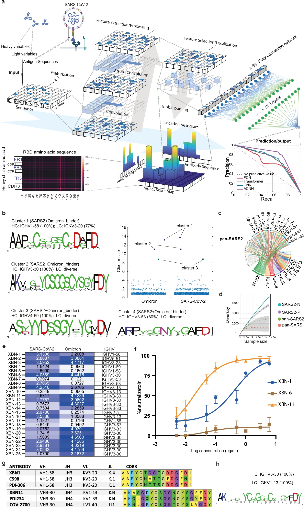

<div align="center">
<h1> XBCR-net (Cross B-Cell Receptor network) for antibody-antigen binding prediction </h1>

[](https://www.nature.com/articles/s41422-022-00727-6) \| 
[](https://colab.research.google.com/github/jianqingzheng/XBCR-net/blob/main/XBCR_net.ipynb)

</div>

Code for *Cell Research* paper [Deep learning-based rapid generation of broadly reactive antibodies against SARS-CoV-2 and its Omicron variant](https://doi.org/10.1038/s41422-022-00727-6)


> This repo provides an implementation of the training and inference pipeline of XBCR-net based on TensorFlow and Keras. The original implementation of its backbone network ACNN could be found in [ACNN repo](https://github.com/XiaoYunZhou27/ACNN).

---
### Contents ###
- [0. Brief Introduction](#0-brief-intro)
- [1. Installation](#1-installation)
- [2. Usage](#2-usage)
  - [2.1. Training (optional)](#21-training-optional)
  - [2.2a. Inference by entering data](#22a-inference-by-entering-data)
  - [2.2b. Batch Inference](#22b-batch-inference)
- [3. Citing this work](#3-citing-this-work)

---

## 0. Brief Intro ##


<ul style="width: auto; height: 200px; overflow: auto; padding:0.4em; margin:0em; text-align:justify; font-size:small">
	<li>a. The features of the amino acid sequences of VH, VL and RBD sequences were extracted, localized and max-pooled to be concatenated together as input to the fully connected layers. 
	The active features in the latent space were then processed by Multi-Layer Perceptron to predict the binding probability of antibody to multiple antigens. 
	The impact score of VH, VL and RBD is calculated on the local histogram impact score map, representing how much weight is given to the specified amino acids on VH, VL (y axis) and RBD (x axis). 
	Prediction results are evaluated by Precision-Recall curves of ACNN (Violet), Transformer (Gray), FCN (Red) and CNN (Blue). 
	</li>
	<li>b. The HCDR3 sequences of the predicted SARS-CoV-2 and Omicron variant binders are clustered by using an 80% sequence similarity. 
	Cluster size represents the number of BCR sequences in the cluster. 
	For each expanded cluster, the HCDR3 sequences are visualized as a sequence logo plot, where y-axis represents the frequency of the individual amino acid at the corresponding position in x-axis. 
	The frequency of the dominating VH gene is listed above the logo. 
	</li>
	<li>c. Circos plot showing the frequency of antibodies encoded by the specified V region to J region pairing of the pan-SARS2 sequences. 
	</li>
	<li>d. The diversity of the four groups of BCR repertoire is analyzed, which is linked to the sample number of each group. 
	</li>	
	<li>e. Binding of the predicted cross-reactive antibodies to RBD of SARS-CoV-2 and Omicron variants (left panel) was examined by ELISA. 
	Representative OD reading is plotted as heatmap ranging from 0.05 to 5.0, and OD of 0.1 is used as cut-off value (n = 3 per group). 
	</li>
	<li>f. The SARS-CoV-2 Omicron variant (BA.1) pseudovirus neutralization curves of XBN-1, XBN-6 and XBN-11 mAbs were generated from luciferase readings at 8 dilutions (n = 3). 
	</li>
	<li>g. HCDR3 sequences of the XBN-1 and XBN-11 are aligned with the most convergent anti-SARS-CoV-2 antibodies from the published studies. 
	</li>
	<li>h. The HCDR3 sequence frequency of the dominant cluster (encoded by IGHV3-30 and IGKV1-13) of the pan-SARS group is shown.
	</li>
</ul>

---

## 1. Installation ##

Clone code from Github repo: https://github.com/jianqingzheng/XBCR-net.git

```shell
git clone https://github.com/jianqingzheng/XBCR-net.git
cd XBCR-net/
```

install packages

[]()
[](https://pypi.python.org/pypi/ansicolortags/)
[](www.tensorflow.org)
[](https://numpy.org)
[](https://pandas.pydata.org/)

```shell
pip install tensorflow==2.4.1
pip install numpy==1.19.5
pip install pandas==1.1.0
```

> Other versions of the packages could also be applicable

---

## 2. Usage ##
\* Setup
```
[$DOWNLOAD_DIR]/XBCR-net/           
├── data/[$data_name]/
|   ├── exper/
|   |	|   # experimental dataset for training (.xlsx|.csv files)
|   |   └── example-experimental_data.xlsx
|   ├── nonexp/
|   |	|   # negative samples for training (.xlsx|.csv files)
|   |   └── example-negative_data.xlsx
|   └── test/
|       ├── ab_to_pred/
|       |   |   # the antibody data for inference
|       |   └── example-antibody_to_predict.xlsx 
|       ├── ag_to_pred/
|       |   |     # the antigen data for inference
|       |   └── example-antigen_to_predict.xlsx 
|       └── results/
|           |    # the files to print the inference results
|           └── results_rbd_[$model_name]-[$model_num].xlsx 
└── models/[$data_name]/
    └── [$data_name]-[$model_name]/
        |   # the files of model parameters (.tf.index and .tf.data-000000-of-00001 files)
        ├── model_rbd_[$model_num].tf.index
        └── model_rbd_[$model_num].tf.data-000000-of-00001
```
> Default data can be also downloaded from [Data_S1](https://static-content.springer.com/esm/art%3A10.1038%2Fs41422-022-00727-6/MediaObjects/41422_2022_727_MOESM2_ESM.xlsx) (unnecessary in usage)


### 2.1. Training (optional) ###

1. Upload the experimental data in ```XBCR-net/data/$data_name/exper/``` and the non-experimental data in ```XBCR-net/data/$data_name/nonexp/```
2. Run ```python main_train.py --model_name XBCR_net --data_name $data_name --model_num $model_num --max_epochs max_epochs --include_light [1/0]```
3. Check the saved model in ```XBCR-net/models/$data_name/$data_name-XBCR_net/```

<div align="center">
	
| Argument              | Description                                	|
| --------------------- | ----------------------------------------------|
| `--data_name` 	| The data folder name                       	|
| `--model_name`        | The used model                      	     	|
| `--model_num`         | The index number of trained model          	|
| `--max_epochs`        | The max epoch number for training 	     	|
| `--include_light`     | 1/0: include/exclude input of a light chain	|

</div>

\* Example for training (default):
1. Check the experimental data in ```XBCR-net/data/$data_name/exper/``` and the non-experimental data in ```XBCR-net/data/$data_name/nonexp/```
2. Run
```shell
python main_train.py --model_name XBCR_net --data_name binding --model_num 0 --max_epochs 100 --include_light 1
```
3. Check the saved model in ```XBCR-net/models/$data_name/$data_name-XBCR_net/```

### 2.2a. Inference by entering data ###
\* Example for a single data point:

```shell
HEAVY='VQLVESGGGLVQPGGSLRLSCAASGFTFSSYDMHWVRQTTGKGLEWVSTIGTAGDTYYPDSVKGRFTISREDAKNSLYLQMNSLRAGDTAVYYCARGDSSGYYYYFDYWGQGTLLTVSS'
LIGHT='DIEMTQSPSSLSAAVGDRVTITCRASQSIGSYLNWYQQKPGKAPKLLIYAASSLQSGVPSRFSGSGSGTDFTLTISSLQPEDFAIYYCQQSYVSPTYTFGPGTKVDIK'
ANTIG='RVQPTESIVRFPNITNLCPFGEVFNATRFASVYAWNRKRISNCVADYSVLYNSASFSTFKCYGVSPTKLNDLCFTNVYADSFVIRGDEVRQIAPGQTGKIADYNYKLPDDFTGCVIAWNSNNLDSKVGGNYNYLYRLFRKSNLKPFERDISTEIYQAGSTPCNGVEGFNCYFPLQSYGFQPTNGVGYQPYRVVVLSFELLHAPATVCGPKKSTNLVKNKCVNF'

python pred_bcr.py --heavy $HEAVY --light $LIGHT --antig $ANTIG --model_name XBCR_net --data_name binding --model_num 0
```

\* Example for multiple data points (split by ','):

```shell
HEAVY='VQLVESGGGLVQPGGSLRLSCAASGFTFSSYDMHWVRQTTGKGLEWVSTIGTAGDTYYPDSVKGRFTISREDAKNSLYLQMNSLRAGDTAVYYCARGDSSGYYYYFDYWGQGTLLTVSS, EVQLVESGGGLVQPGGSLRLSCAASGFTFNNYWMSWVRQAPGKGLEWVANINQDGSEKYYVDSVMGRFAISRDNAKNSLYLQMNSLRAEDTAVYYCARDQGYGDYFEYNWFDPWGQGTLVTVSS'
LIGHT='DIEMTQSPSSLSAAVGDRVTITCRASQSIGSYLNWYQQKPGKAPKLLIYAASSLQSGVPSRFSGSGSGTDFTLTISSLQPEDFAIYYCQQSYVSPTYTFGPGTKVDIK, DIQLTQSPSFLSASVGDRVTITCRASQGIYSYLAWYQQKPGKAPKLLIYAASTLQSGVPSRFSGSGSGTEFTLTISSLQPEDFATYYCQQLNSYPITFGQGTRLEIK'
ANTIG='RVQPTESIVRFPNITNLCPFGEVFNATRFASVYAWNRKRISNCVADYSVLYNSASFSTFKCYGVSPTKLNDLCFTNVYADSFVIRGDEVRQIAPGQTGKIADYNYKLPDDFTGCVIAWNSNNLDSKVGGNYNYLYRLFRKSNLKPFERDISTEIYQAGSTPCNGVEGFNCYFPLQSYGFQPTNGVGYQPYRVVVLSFELLHAPATVCGPKKSTNLVKNKCVNF, RVQPTESIVRFPNITNLCPFGEVFNATRFASVYAWNRKRISNCVADYSVLYNSASFSTFKCYGVSPTKLNDLCFTNVYADSFVIRGDEVRQIAPGQTGKIADYNYKLPDDFTGCVIAWNSNNLDSKVGGNYNYLYRLFRKSNLKPFERDISTEIYQAGSTPCNGVEGFNCYFPLQSYGFQPTNGVGYQPYRVVVLSFELLHAPATVCGPKKSTNLVKNKCVNF'

python pred_bcr.py --heavy $HEAVY --light $LIGHT --antig $ANTIG --model_name XBCR_net --data_name binding --model_num 0
```
> Spaces (' ' or '_') and carriage returns ('\n') do not affect data recognition

<div align="center">
	
| Argument              | Description                                	|
| --------------------- | ----------------------------------------------|
| `--heavy` 		| The heavy chain           			|
| `--light` 		| The light chain                       	|
| `--antig` 		| The antigen                       		|
| `--data_name` 	| The data folder name                       	|
| `--data_name` 	| The data folder name                       	|
| `--model_name`        | The used model                      	     	|
| `--model_num`         | The index number of the used model         	|

</div>

### 2.2b. Batch Inference ###

1. Upload the antibody file in ```XBCR-net/data/$data_name/ab_to_pred/``` and the antibody file in ```XBCR-net/data/$data_name/ag_to_pred/```
2. Run ```python main_infer.py --model_name XBCR_net --data_name $data_name --model_num $model_num --include_light [1/0]```
3. Download the result Excel file from ```XBCR-net/data/binding/test/results/*```

<div align="center">
	
| Argument              | Description                                	|
| --------------------- | ----------------------------------------------|
| `--data_name` 	| The data folder name                       	|
| `--model_name`        | The used model                      	     	|
| `--model_num`         | The index number of trained model          	|
| `--include_light`     | 1/0: include/exclude input of a light chain	|

</div>

\* Example for inference (default):
1. Check the antibody file in ```XBCR-net/data/$data_name/ab_to_pred/``` and the antibody file in ```XBCR-net/data/$data_name/ag_to_pred/```
2. Run
```shell
python main_infer.py --model_name XBCR_net --data_name binding --model_num 0 --include_light 1
```
3. Download the result Excel file from ```XBCR-net/data/binding/test/results/results_rbd_XBCR_net-0.xlsx```

---

## 3. Citing this work

Any publication that discloses findings arising from using this source code or the network model should cite:
- Hantao Lou, Jianqing Zheng, Xiaohang Leo Fang, Zhu Liang, Meihan Zhang, Yu Chen, Chunmei Wang, Xuetao Cao, "Deep learning-based rapid generation of broadly reactive antibodies against SARS-CoV-2 and its Omicron variant." *Cell Research* 33.1 (2023): 80-82.
```bibtex
@article{lou2022deep,
  title={Deep learning-based rapid generation of broadly reactive antibodies against SARS-CoV-2 and its Omicron variant},
  author={Lou, Hantao and Zheng, Jianqing and Fang, Xiaohang Leo and Liang, Zhu and Zhang, Meihan and Chen, Yu and Wang, Chunmei and Cao, Xuetao},
  journal={Cell Research},
  pages={1--3},
  year={2022},
  publisher={Nature Publishing Group},
  doi={10.1038/s41422-022-00727-6},
}
```
and, if applicable, the [ACNN paper](https://ieeexplore.ieee.org/abstract/document/9197328):
- Xiao-Yun Zhou, Jian-Qing Zheng, Peichao Li, and Guang-Zhong Yang, "ACNN: a full resolution dcnn for medical image segmentation." *2020 IEEE International Conference on Robotics and Automation (ICRA)*. IEEE, 2020.
```bibtex
@inproceedings{zhou2020acnn,
  title={Acnn: a full resolution dcnn for medical image segmentation},
  author={Zhou, Xiao-Yun and Zheng, Jian-Qing and Li, Peichao and Yang, Guang-Zhong},
  booktitle={2020 IEEE International Conference on Robotics and Automation (ICRA)},
  pages={8455--8461},
  year={2020},
  organization={IEEE},
  doi={10.1109/ICRA40945.2020.9197328},
}
```

